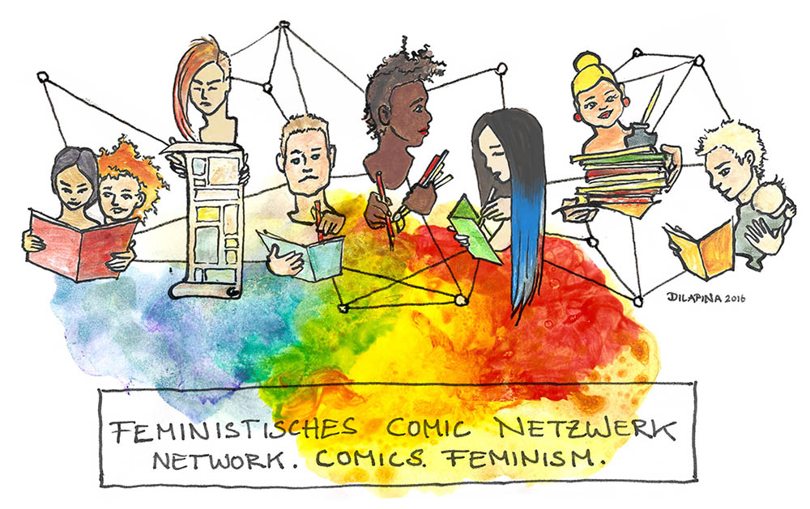

## Zine Call
The Feminist Comic Network is pleased to announce its first Zine!

**Topic: "Troll Control"  
Deadline: February 10, 2017  
Specs: 300dpi, A5, b/w**

[FACEBOOK EVENT](https://www.facebook.com/events/1746382625678734/)

As we all know, Internet trolls are the scourge of the online community. Women in particular are in the crosshairs of those who spend time and effort to talk down, make fun of or harass for fun and games. This Zine would like to raise awareness of the damage this behavior causes, and also to show strategies of dealing with it, as well as support those who have been targeted. The Zine is not limited to the digital sphere so feel free to submit any interpretation of the theme. You can submit a comic in English and German.

We would like to especially encourage all marginalized people to participate! Your voice matters!

This zine is completely d.i.y., as we are a non-profit organization we unfortunately cannot offer payment, any profit gathered from sales will go towards print and distribution costs.

 You will get a free issue (and the master-print, if you would like to print'n'sell your own copies.)

 If you have a story to tell but aren’t an artist, or if you’re an artist who wants to contribute but doesn’t know what to draw, we want you to team up! Use the hashtag **#TrollControl** on Twitter to find each other, tag us in the tweet [@comicwitches](https://twitter.com/comicwitches) or if you’d prefer to remain anonymous, email us at <feministische.comics@gmail.com> **before January 31st**, and we will do our best to pair you with someone. All genders are welcome!

Submit your proposals to <feministische.comics@gmail.com> by **February 10th**, with the word SUBMISSION in the subject line. Please include a detailed synopsis(summary), a proposed page count and links to samples of previous comics and/or writing if you have that. If this is your first work that's absolutely fine and we warmly welcome newcomers! We favor submissions with both a visual and a written component, but are open to just words or images if the concept is strong.

## Manifesto
Wir sind echt froh, dass du uns gefunden hast. Das **Feministische Comic Netzwerk** ist ein Gemeinschaftsprojekt von feministischen Comicschaffenden und Fans aller Gender. Momentan befindet sich die Hauptorganistationsgruppe in Berlin. Wir arbeiten deutschlandweit und international. Unser Ziel ist die Förderung von intersektionellem, zugänglichem, inklusiven und einladendem Feminismus in Comics. Dadurch wollen wir Hierarchien einreißen und Vorurteile kritisch hinterfragen. Das Netzwerk konzentriert sich auf gemeinschaftliches Arbeiten, inspirierendes, professionelles Netzwerken und das Sichtbarmachen von feministischen Comics und ihren MacherInnen.

*We are glad you found us. The **feminist comic network** is a community project of self-identified feminist comic authors and enthusiasts of all genders. The main organizing is based in Berlin, and we act internationally / Germany-wide. We promote intersectional, accessible, welcoming and inclusive feminism in comics, with an aim to break down the hierarchies in the comics scene and challenge the stereotypes. THE NET focuses in community work, inspiring, professional networking and bringing visibility to feminist comics and their creators.*

## Contact | Kontakt:
Kontaktiere uns gerne! / Get in touch!

**Meetup:** Es gibt ein Meetup an wechselnden Orten. Schreib' uns gerne eine Mail und wir sagen dir Bescheid, wo es diesen Monat stattfindet.  
*We have a monthly meetup at different places. Contact us via mail and we'll tell you where to meet.*

**Mail:** <feministische.comics@gmail.com>

**Facebook Group:** [Feministisches Comic Netzwerk](https://www.facebook.com/groups/1712474105664302)

**Twitter:** [@ComicWitches](https://twitter.com/comicwitches)
